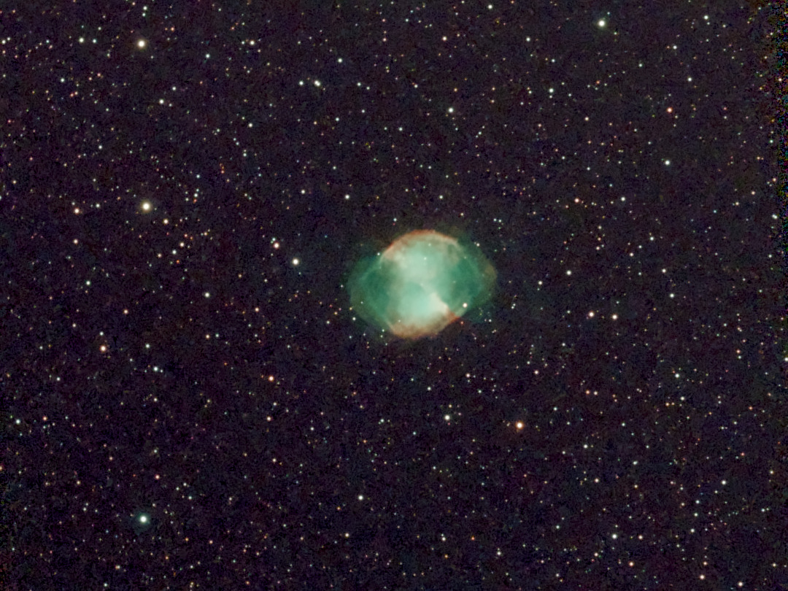

- **Location**: Bear Branch (39°38'50"N 76°59'11"W)
- **Equipment**: Celestron C14 f/11 SCT
- **Conditions**: Clear skies, average seeing

## Messier 27 (NGC 6853)

- **RA/Dec**: 19h 59m 36.319s / +22° 43′ 16.312″
- **Type**: Planetary Nebula
- **Constellation**: Vulpecula
- **Distance**: 815 ly (250 pc)
- **Apparent Magnitude**: 7.4
- **Size**: 8.0′ × 5.6′

(description from WASI 130 observing guide)

M27 is a photographic wonder, a beautiful planetary nebula. Discovered in 1764
by Charles Messier, alas, he could never see much more than a faint blob.

M27 is one of the biggest (1.2 light years long) and closest (815 light years)
of all planetaries. It’s one of the oldest, too, as the gas was blown off the
central star 48,000 years ago. (The average age of planetaries is 20,000 years).

It’s a double-shelled planetary. The inner shell is doubly- ionized oxygen
expanding at 15 km/s; the outer is ionized nitrogen expanding at 30 km/s. The
gas in those shells glows from UV light emitted by the central star.

Deep Sky Companions: The Messier Objects says “But M27’s central star is the
real demon. Although stars of 14th magnitude are usually a cinch from pristine
skies, glimpsing this one requires keep averted vision. The reason might lie in
the difficult of seeing stars through nebulosity.”

Admiral Smyth, in his 1844 Bedford Catalogue, enthused "a magnificent and
singular object… situated in a crowded vicinity where field after field is very
rich…. Truly one of those splendid enigmas which, according to Ricciolus are
proposed by God but never to be subject to human solution." M27 is three degrees
north of Gamma Sagittae.

{ .img-fluid .mb-5 }

## Observation Notes

It's very nice!!

{ .img-fluid .mb-5 }
