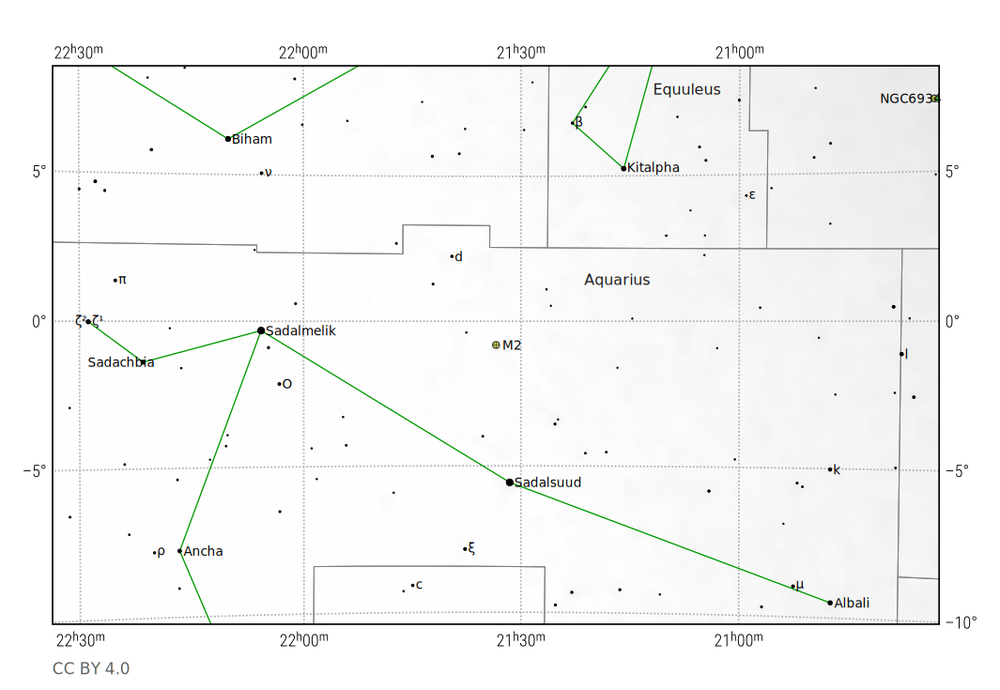
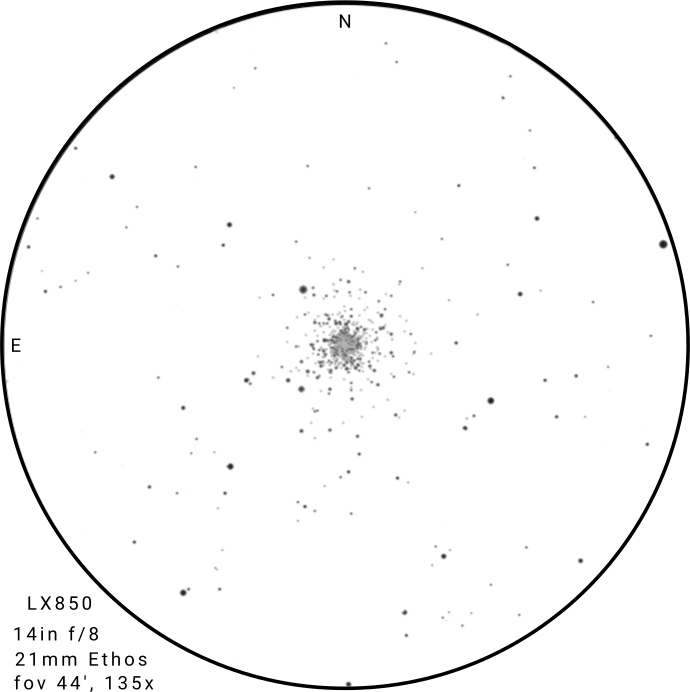

- **Date/Time**: 2025-09-13T22:30:00 EDT
- **Location**: Klee Mill (39°26'06"N 76°59'24"W)
- **Equipment**: LX850 14" f/8 SCT
- **Conditions**: Clear skies, average seeing

## Messier 2 (NGC 7089)

- **RA/Dec**: 21h 33m 27.02s / -00° 49' 23.7"
- **Type**: Globular Cluster
- **Constellation**: Aquarius
- **Distance**: 55,000 ly (17 kpc)
- **Apparent Magnitude**: 6.5
- **Size**: 16 arcminutes

M2 is one of the largest and brightest globular clusters in the night sky,
containing over 150,000 stars. It is located in the northern part of the
constellation Aquarius about 8° west of α Aquarii (Sadalmelik) and 5° north of β
Aquarii (Sadalsuud). M2 is easily visible with binoculars or a small telescope
but appears non-stellar. Larger telescopes reveal its dense core and many
individual stars the brighter ones being of magnitude 6.5.

{ .img-fluid .mb-5 }

## Observation Notes

At 135x magnification, M2 appears as a round mottled 6' glow with a dense bright
core. There are two bright stars in the halo to the NW and SW and two more
further out in the SE and SW. About a hundred stars are visible across the core
and halo when seeing periodically improves. The core is very bright and
concentrated, the halo is pretty dim with several brighter stars visible. A few
not very prominent chains of stars extend into the halo, and there is a dark
lane in the NE.

{ .img-fluid .mb-5 }

The field is not particularly dense, but has a couple brighter star scattered
around. There's a 9.8 mag star on the eastern edge of the field, and another
about 9.7 mag just outside the fov on the west side. Seeing conditions were
average for Maryland (meaning not good), but improved periodically allowing more
stars to be seen.